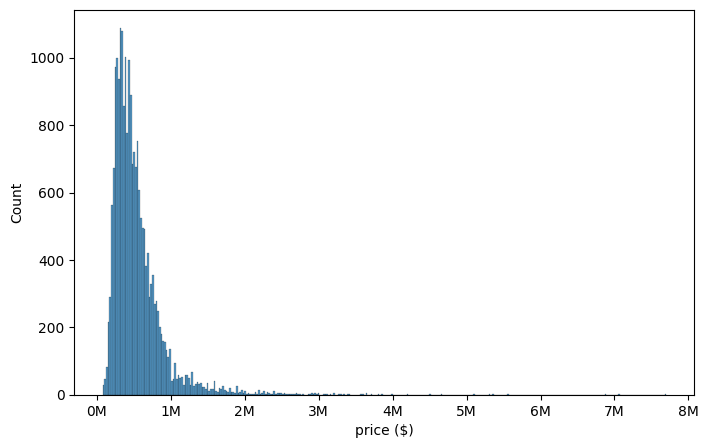

# King County Housing: Exploratory Data Analysis

The goal of this project was to analyse the King County housing market based on a dataset containing various characteristics of over 20,000 housing units and make recommendations for a fictitious client looking to buy a house in the area.

--- 

## Project overview

* Examined client characteristics and formed testable hyptoheses
* Selected existing and created new relevant features to be analysed
* Testing hypotheses via correlations
* Visualisations: Geographical, scatterplots and boxplots (correlations)
* Insights and recommendations for the client
 

## Repository content
* **Presentation:** Project insights and recommendations (PDF and PPT)
* **Visualisations:** Contains graphs and visualisations
* King County Housing dataset
* Description of features/columns (markdown)
* Fetching data from a database using psycopg2 (python notebook)
* King County Housing EDA (python notebook)

 

## Resources used
* **Python version:** pyenv with python 3.11.3
* **Packages**: pandas, numpy, matplotlib, seaborn

 

---

## Client characteristics

* Desires a waterfront
* Has limited budget
* Wants a nice and isolated but central neighborhood without many children (has to kids of his own)
 

## Variables in the dataset

* Date
* Price
* Number of bedrooms
* Number of bathrooms
* Sq. footage of living space
* Sq. footage of the lot
* Number of floors
* Located at a waterfront
* Has been viewed
* Overall Condition
* Grade based on King County grading system
* Sq. footage of house apart from basement
* Sq. footage of the basement
* Year built
* Year renovated
* Zipcode
* Latitutde and longitude
* Sq. footage of interior housing living space for the nearest 15 neighbors
* Sq. footage of the land lots of the nearest 15 neighbors

 

Only a subset of the variables was used in the analysis, since the client had specific requirements for the house and the neighbourhood.

 

## Data cleaning

After deciding on the variables based on the client's needs, I took a look at the data at hand and made the following changes: 

* Created a new column **price/sq. foot** to normalize house price with respect to house size
* Classified the price/sq. foot into 5 quantiles to create a variable price categories
* Rounded up and down the number of bathrooms, since many units contained decimal numbers
* Created a new column **bedrooms/bathroom**
* Classified zipcodes into **Urban Outskirts**, **Urban Center** and **Suburbs**
* Created a new column **grade/sq. foot** to normalize the grade with respect to house size
* Classified the grade/sq. foot into 5 quantiles to create a variable with grade categories
* Remove extreme values for bedrooms
* Imputed missing values for the waterfront variable using the K-Nearest-Neighbours imputer
 

## Basic data exploration before the analysis

Exploring the data meant getting a first grasp of the variable types, their distributions and correlations. Here are the more important insights:

* The house price is not normally distributed and contains outliers, while the price/sq. foot is more normally distributed and contains almost no outliers. The latter variable, in addition to the price/sq. quantile variable (see above), was given more importance in the analytical part of the project.

 

* House price and grade are quite correlated with the house size. For this reason, the new columns normalizing house price and grade with respect to sq. footage (see above) provide additional information about house value considering its size.

 

* There are no non-linear relationships between the numerical variables, with the only exception being grade/sq. foot and price.
  

## Data analysis and hypothesis testing

The analytical part of the project involved testing a set of 10 hypotheses in order to establish which areas contain housing units deemed most suitable for the client. Here are some of the more important insights:

### 1. The client might potentially be able to afford some of the more spacious houses, given that the price range spans from low to high.

 

### 2. Most affordable houses seem to be concentrated in suburban areas, which the client does not prefer.

**Recommendation: The client should primarily look at houses at Seattle’s periphery where prices are still affordable.**

  

### 3. The vast majority of houses with a waterfont are most likely out of the client's price range.

**Recommendation: There do exist some not overly expensive options at the outskirts towards the south-western part of Seattle.**

  

### 4. While most areas with the lowest median house size seem to be concentrated in Seattle's center, there are still a few neighbourhoods located on city outskirts that seem to have relatively small housing units and are likely to contain childless households.

**Recommendation: Considering how prices in Seattle’s periphery tend to be lower, these neighbourhoods can be an attractive solution for the client. In particular the northwest and parts of the southern outskirts**

  

### 5. The larger the general lot size in a neighbourhood, the more quiet and less busy it is. 

**Recommendation: Most of Seattle's peripheral areas seem to provide a good mix between isolated, yet urban neighbourhoods.**

  

### **Area recommendations**

| Zip codes | Avg. House size (sqft) | Avg. Number of Bedrooms | Median Price ($/sqft) | Median neighbour house size (sqft) | Median neighbour lot size (sqft) | Median Grade | Waterfront |
|-----------|------------------------|----------|----------------|----------------------------------|---------------------------------|-------|------------|
| 98146     | 1490                   | 3        | 202            | 1440                             | 8100                            | 7     | Unlikely |
| 98166     | 1930                   | 3        | 212            | 1635                             | 10751                           | 7     | Unlikely|

  

For a more detailed overview of the analysis, please refer to the notebook *king_county_housing.ipynb*!